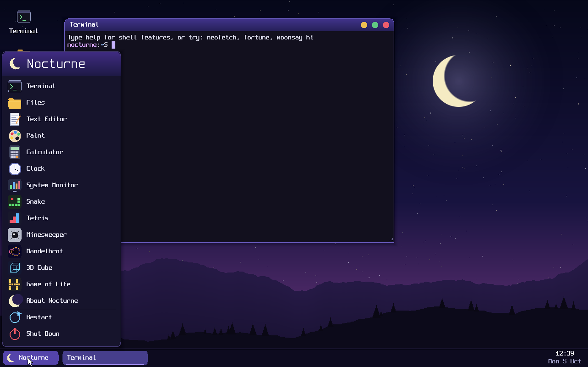
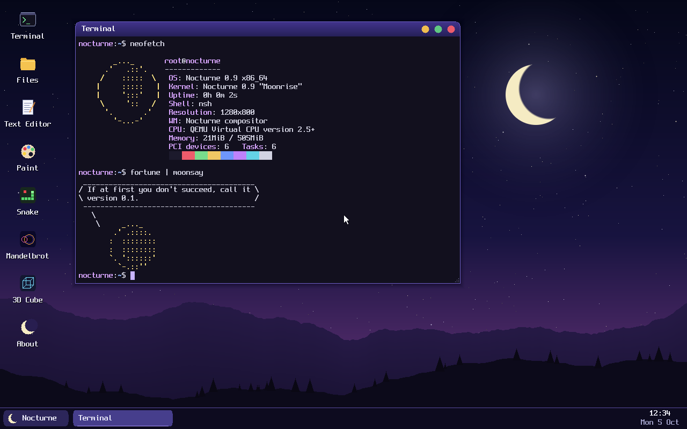
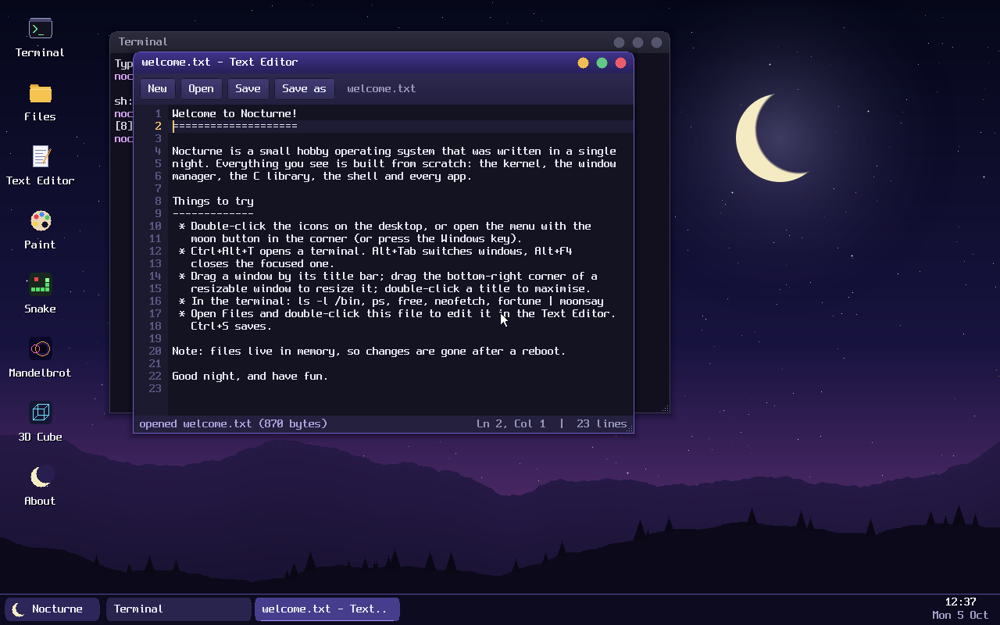
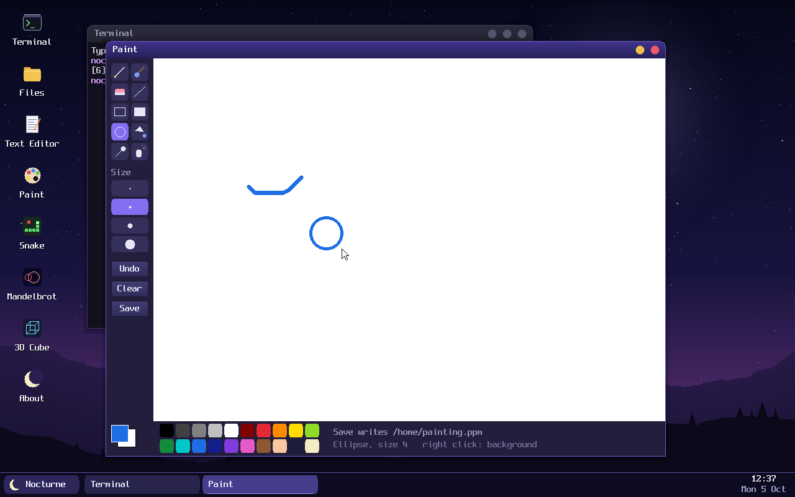
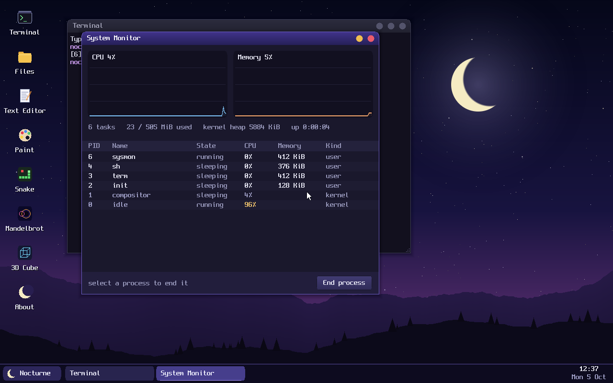
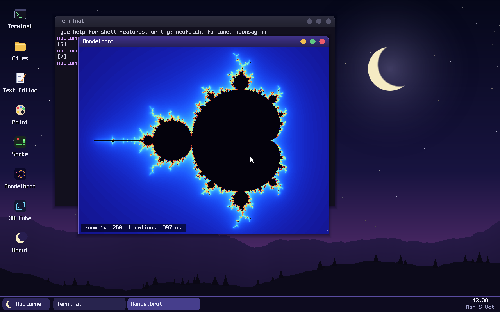
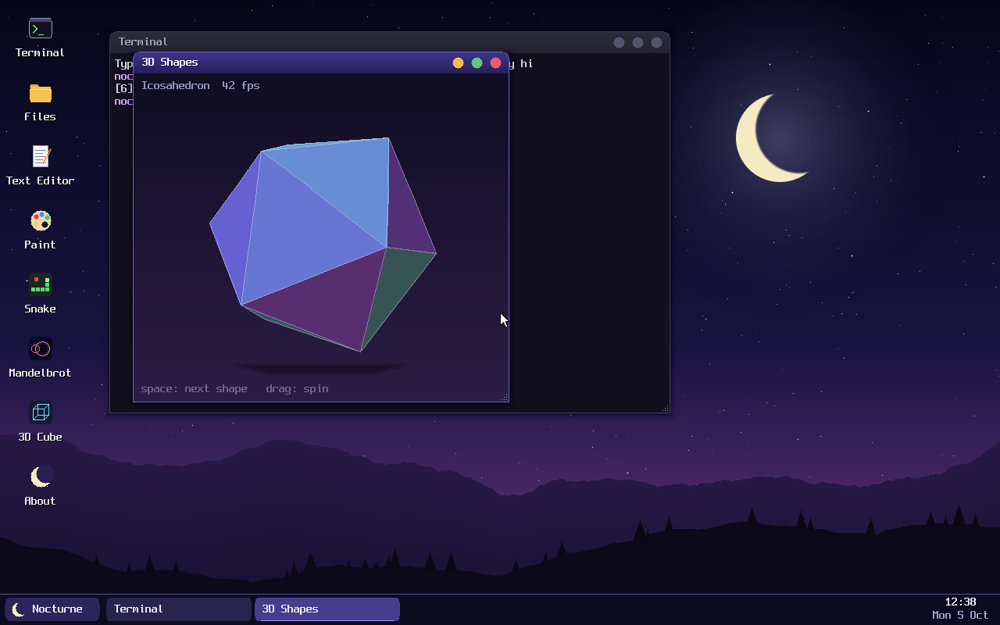
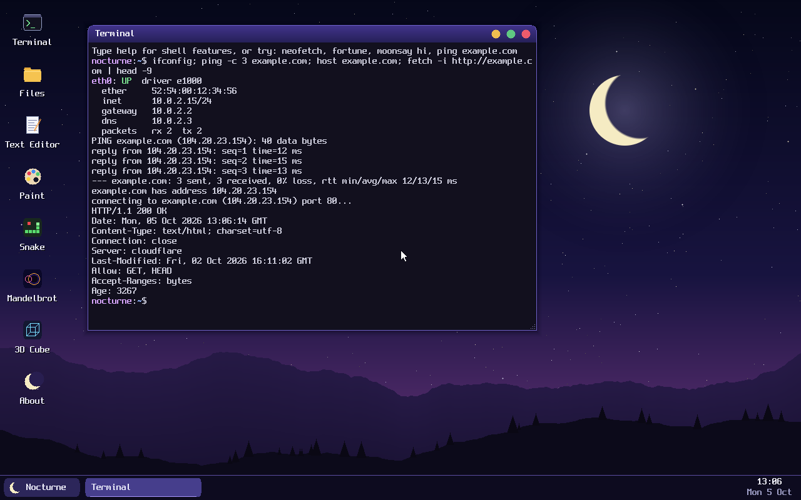
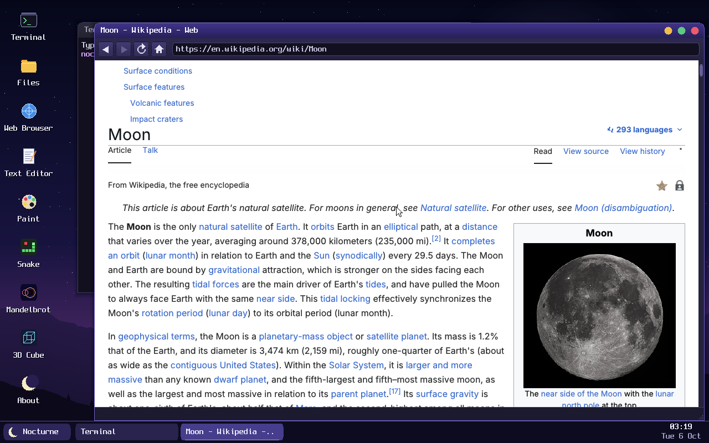
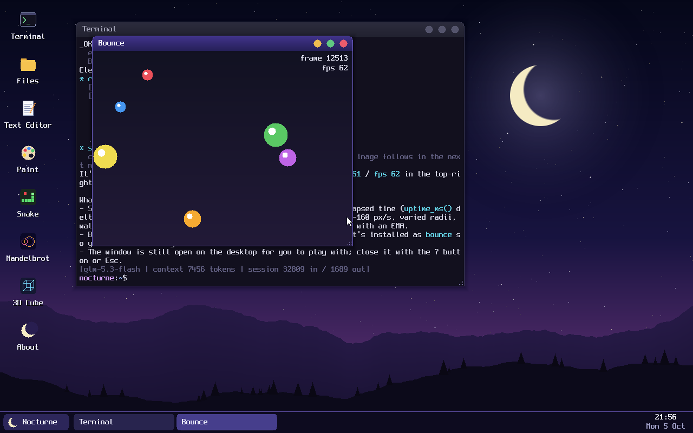

# Nocturne OS

*A small operating system for quiet nights.*

Nocturne is a hobby x86-64 operating system written from scratch: the kernel, a compositing window
manager, a TCP/IP stack, a C library, a web browser engine, a shell, a terminal emulator and about 50 programs. It was
written with an AI coding assistant (Claude Code) over several long sessions, and is meant for
virtual machines (QEMU and Hyper-V); it has not been tried on real hardware. It is a toy, not a
general-purpose OS: see [Limits](#limits). A few borrowed pieces of code are included:
- Limine loads the kernel and the initial ramdisk.
- BearSSL provides TLS.
- TinyCC is the C compiler that runs inside the OS.
- stb_truetype, stb_image, JebP and NanoSVG read fonts and images for the web browser, which draws text in Inter.

Nocturne also has an **AI agent**. `agent` connects to an LLM over HTTPS, and the model can then run
commands, write C, compile it with `tcc`, start it and look at the screen to check the result.
Everything it writes is kept on a persistent disk.

Nocturne has its own **web browser**. HTML and CSS (block, inline, float, table, flexbox and grid
layout) are parsed, laid out and painted by an engine written for Nocturne.
QuickJS の実験的な統合がありますが、ブラウザー API は未完成です。
**現時点で YouTube、DeepMind、通常版 DuckDuckGo、ChatGPT の正常動作は確認できていません。**
実サイトの QEMU 検証結果と残課題は [検証記録](docs/browser-validation-2026-10-06.md) を参照してください。
その後の JavaScript・Shift_JIS 修正と実サイト再検証は [追補](docs/browser-js-progress-2026-10-06.md) に記録しています。指定4サイトの全面動作は未達成です。



| | |
|---|---|
|  |  |
|  |  |
|  |  |

## What's inside

**Kernel** (`kernel/`, about 13,500 lines of C)
- Boots through Limine (BIOS or UEFI) into a higher-half x86-64 kernel.
- Memory: physical page allocator, 4-level paging, kernel heap, and a separate address space for every process.
  - W^X: no page is both writable and executable. ELF segments are mapped with their own permissions, the stack and heap are no-execute (NX), and the kernel's own code, read-only data and data are mapped separately. Write protection also applies in ring 0.
  - `mmap`, `munmap` and `mprotect` are real, which is how `tcc -run` gets executable memory for the code it just compiled.
- Processes: ring-3 user processes with ELF loading, preemptive scheduling (1 kHz local APIC timer, or the PIT), `int 0x80` system calls, `spawn` and `waitpid`, process trees, and `kill`.
- Files: a VFS with a RAM filesystem (populated from a tar initrd), `/dev` (console, null, zero, random, audio, volume), pipes, and `poll`.
- Persistent storage: ATA PIO and Hyper-V SCSI disk drivers and a FAT32 filesystem (read and write), which is mounted at `/data`.
- Drivers: PS/2 keyboard and wheel mouse, framebuffer, serial, CMOS clock, PCI enumeration, and ACPI power-off and reboot.
- Sound: every open of `/dev/audio` is a stream of 48 kHz stereo samples. The kernel mixes the streams, applies the master volume (`/dev/volume`) and plays them on an Intel AC'97 card (QEMU, VirtualBox), or sends them to the Enhanced Session's client. See [Sound](#sound).
- Hyper-V: VMBus and its synthetic devices, so Nocturne runs in a Generation 2 VM. See [Running it in Hyper-V](#running-it-in-hyper-v).
  - Keyboard, absolute mouse, SCSI disks and network adapter.
  - Heartbeat, graceful shutdown and restart from Hyper-V Manager, the host's clock (time sync), and the key-value exchange, so Hyper-V Manager shows the VM's IP address and OS.
  - Hyper-V sockets, and an RDP server on them for VMConnect's **Enhanced Session**: the desktop takes the size of the VMConnect window, text copied on either side pastes on the other, and sound plays on the host.
- Networking: drivers for the Intel e1000 (QEMU, VirtualBox, VMware), the DEC 21140 "tulip" (Hyper-V's legacy network adapter) and Hyper-V's synthetic adapter, and a small TCP/IP stack: Ethernet, ARP, IPv4, ICMP, UDP, a DHCP client, a DNS resolver and a TCP client.
  - TCP keeps out-of-order segments and reassembles them, and does NewReno congestion control (slow start, fast retransmit and fast recovery) with a retransmission timeout taken from the measured round-trip time.
- Graphics: a compositing window manager. It runs in the kernel, which keeps it simple and fast, but a bug in it can bring the whole system down.
  - Window buffers are shared memory and redraws are damage-tracked.
  - Windows have drop shadows and can be dragged, resized, maximized and minimized.
  - The desktop has a taskbar, start menu, desktop icons, toast notifications and a clipboard.
  - The night-sky wallpaper is generated procedurally.

**Userland** (`user/`)
- libc: stdio, `printf` with correctly rounded floating point, `malloc`, string, math and time functions, `qsort`, `strtod`, `setjmp`, and more. It is a subset of C99/POSIX, not a complete one.
  - It also includes an HTTP/1.1 client with HTTPS, a JSON parser and builder, and a PNG encoder.
  - The web engine (`user/libc/web/`, about 11,000 lines): an HTML parser, CSS cascade and layout, and painting with anti-aliased TrueType text, images and gradients. See [The web browser](#the-web-browser).
- Shell (`sh`):
  - Pipes, redirection (`< > >> 2>`), `&`, `;`, `&&` and `||`, quoting, globbing, `$?` and script arguments (`$1`, `$#`, `$@`). There are no variables, `if` or loops.
  - History, tab completion and scripts.
- Terminal: ANSI colours, UTF-8, scrollback, copy and paste, and resizing.
- Command-line tools: `ls cat cp mv rm mkdir touch tree grep wc head hexdump echo ps kill free uptime date uname dmesg lspci sleep clear reboot poweroff neofetch fortune moonsay`
- Sound: `beep` (tones and melodies), `play` (WAV files) and `volume`, for scripts; everything they do can be done from the desktop.
- Network tools: `ifconfig`, `ping`, `host` (DNS lookup) and `fetch` (an HTTP and HTTPS client).
- Development: the `tcc` C compiler, with headers and a static libc in `/usr`. The source of every program in `/bin` is in `/usr/src/apps`.
- `agent`: the AI agent (see below). `screenshot` saves the screen as a PNG.
- Desktop apps: Web Browser, Files, Text Editor, Paint, Calculator, Clock, System Monitor, Piano and Sound Player. The taskbar's speaker sets the volume.
- Games and toys: Snake, Tetris, Minesweeper (all three with sound effects), Mandelbrot, 3D Shapes and Game of Life.

## Running it in Hyper-V

You need Windows with Hyper-V enabled. Run this once from an **elevated** (administrator) PowerShell in this folder:

```powershell
powershell -ExecutionPolicy Bypass -File hyperv.ps1
```

This creates a **Generation 2** VM called `Nocturne` with the following settings:
- 512 MB of static memory and 1 CPU.
- Secure Boot off (the boot loader is not signed).
- The boot disk (`hyperv\Nocturne-boot.vhdx`) on SCSI 0:0 and the [data disk](#persistent-storage-data) on SCSI 0:1.
- A network adapter on the **Default Switch**, so the VM gets an address by DHCP and can reach the internet.
- The Enhanced Session over Hyper-V sockets. If the host has Enhanced Session Mode turned off, the script turns it on.
- No checkpoints.
- COM1 connected to `\\.\pipe\nocturne-com1`.

The script then starts the VM and opens a VMConnect window.

**Enhanced Session.** VMConnect asks for a display size once Nocturne is up. That is the Enhanced
Session: VMConnect connects to the RDP server inside Nocturne, and the desktop takes the size you
pick. When a client resizes its window it sends the new size over the display control channel,
and the desktop follows it. Keyboard and mouse go through the same connection, with no mouse capture, and so does the
clipboard: text copied in Windows pastes in Nocturne (Ctrl+V in the Text Editor and the browser's
address bar, Ctrl+Shift+V in the terminal), and text copied in Nocturne (Ctrl+C, or Ctrl+Shift+C
for the terminal's screen) pastes in Windows. Sound plays through the host's speakers (VMConnect's
**Local Resources > Remote audio** setting must be "Play on this computer", its default). Choose
**View > Enhanced Session** to switch back to the basic console, which shows the desktop at the
framebuffer's size. Nocturne returns to that size when the Enhanced Session ends.

Other options:

| Command | What it does |
|---|---|
| `hyperv.ps1 -Update` | Copy a freshly built disk into the existing VM and restart it. The VM keeps its generation. |
| `hyperv.ps1 -Generation 1` | Create a Generation 1 VM instead (see below). |
| `hyperv.ps1 -Iso` | Boot from `build\nocturne.iso` on the DVD drive instead of the disk. |
| `hyperv.ps1 -Remove` | Delete the VM. |
| `hyperv.ps1 -NoNetwork` | Create the VM without a network adapter. |
| `hyperv.ps1 -Switch "Name"` | Connect the network adapter to a different virtual switch. |
| `hyperv.ps1 -Name Foo -MemoryMB 1024` | Use a different VM name and memory size. |

To create a Gen 2 VM by hand instead, turn Secure Boot off and attach `build\nocturne.vhdx` as a SCSI
disk. Set `Set-VM -EnhancedSessionTransportType HvSocket` for the Enhanced Session.

**Generation 1** emulates a legacy PC. Nocturne drives it too: `build\nocturne.vhd` on IDE, the data
disk on IDE 0:1 and a *legacy* network adapter (an emulated DEC 21140). VMConnect shows the basic
console only.

**Tips for VMConnect**
- In the basic console, click inside the window to capture the mouse. **Ctrl+Alt+Left Arrow** releases it.
- The Windows key only reaches the VM in full-screen mode. Use **Ctrl+Esc** to open the start menu instead.
- The boot menu has a **1024x768** entry and a **text console only** entry, in case the default 1280x800 mode isn't available.
- Kernel log: connect any named-pipe client, such as PuTTY (Serial, `\\.\pipe\nocturne-com1`), to COM1. `scripts\hv-serial.ps1` copies it to a file.
- **Mouse moving up when you move down?** On Gen 1, Hyper-V on Windows 11 hosts reports the emulated PS/2 mouse's vertical axis backwards. Nocturne detects Hyper-V (and the host build) and flips the axis itself. If it guesses wrong on your host, press **E** on the boot menu entry and add `cmdline: mouse_y=normal` (or `mouse_y=invert`).

**Development scripts** (`scripts\`, elevated):

| Script | What it does |
|---|---|
| `hv-boot.ps1 -Name VM -Build` | Build, refresh the VM's boot media, boot, record COM1 and take a console screenshot. |
| `hv-esm.ps1 -Name VM` | Open an Enhanced Session in VMConnect and save a picture of the window. |
| `python hv-rdp.py --vm VM --size 1280x720 "type:neofetch\n" dclick:53,130` | Test the Enhanced Session without VMConnect: a small RDP client types and clicks, and saves the desktop it receives as a PNG. `clip:TEXT` and `chord:1d,2a,2f` test the clipboard, `resize:1600x900` a window resize. The sound the server sends is saved as a WAV next to the PNG, with the tones in it listed. |
| `hv-shot.ps1 -Name VM` | Screenshot the VM's console without VMConnect. |
| `hv-sock.ps1 -Name VM -Port N` | Connect to a Hyper-V socket service in the guest from the host. |
| `hv-serial.ps1 -Pipe P -Log F` | Copy a COM port pipe to a log file. |

## Building

Everything needed is in `tools/`:
- A portable MSYS2 with clang, lld, nasm, mtools, xorriso, qemu and python.
- Limine.

```powershell
powershell -ExecutionPolicy Bypass -File build.ps1          # build everything into .\build
powershell -ExecutionPolicy Bypass -File build.ps1 run      # build and boot in QEMU
powershell -ExecutionPolicy Bypass -File build.ps1 clean
```

Outputs in `build\`:
- `nocturne.img`: raw MBR disk, used by QEMU.
- `data.img`: the persistent `/data` disk for QEMU.
- `nocturne.vhd`: fixed VHD for Hyper-V Generation 1.
- `nocturne.vhdx`: dynamic VHDX for Hyper-V Generation 2.
- `nocturne.iso`: hybrid BIOS/UEFI ISO.

## Tests

```powershell
powershell -ExecutionPolicy Bypass -File build.ps1 test        # about 4 minutes
powershell -ExecutionPolicy Bypass -File build.ps1 test-quick  # skips compiling every app
powershell -ExecutionPolicy Bypass -File build.ps1 test-full   # adds tcc rebuilding itself inside the OS
```

`scripts/test.py` boots the image headless in QEMU with a scratch data disk holding `tests/`. Your own
`data.img` is not touched. At boot, `init` runs the suite. The suite compiles its own runner with the
in-OS `tcc` and runs 45 tests, checking each one's exit status and output. Results come back over the
serial port, and afterwards the host checks the FAT32 volume the OS wrote to with `fatcheck.py`. The
tests cover:
- Shell and tools, and `malloc` stress.
- W^X: writing code or read-only data and running the stack or heap must crash, and `mprotect` must work.
- FAT32 and the RAM filesystem: many sizes, long names, 150-file directories, rename and nested directories.
- `tcc`: printf and math, compiling every app, and self-hosting.
- The GUI: a window appears in a screen grab and is gone after it closes.
- Sound: streams, blocking and non-blocking writes, eight streams at once, the volume, `beep`, `play` with 8-, 16-, 24-bit and float WAV files at several rates, and the Sound Player started the way Files starts it. QEMU records the AC'97 card's output to `build/test-audio.wav`, and the host checks that each tone came out with the right pitch on each channel and the right length.
- The web engine, offline: about 80 checks of element positions (blocks, floats, flexbox, grid, tables, `@media`), painted pixels (borders, alpha, gradients, images), links, form submission, charsets and URL resolution. Deeply nested and malformed pages must not crash it.
- Network: DHCP, ping, DNS, HTTP, HTTPS, and a rejected bad certificate.
- TCP: 14 MiB to and from a host-side server, clean and with simulated loss and reordering, checking every byte.
- The agent, offline: it never needs an API key.

The network tests need internet access from the host. Use `python scripts/test.py --no-net` without it.

`scripts/qtest.py` drives a running image by hand: keystrokes, mouse moves and screenshots.

```
python scripts/qtest.py sleep:6 "type:neofetch\n" shot:neofetch goto:51,125 dclick shot:files
```

## Using it

| Keys | Action |
|---|---|
| Super or Ctrl+Esc | Open the start menu (arrow keys and Enter work in it) |
| Ctrl+Alt+T | New terminal |
| Alt+Tab | Switch windows |
| Alt+F4 | Close window |
| Double-click a title bar | Maximize or restore |
| Drag the bottom-right corner | Resize (Terminal, Files, Text Editor, Clock, Mandelbrot, 3D Shapes) |
| Ctrl+Shift+C / Ctrl+Shift+V | Copy screen / paste in the terminal |
| Shift+PgUp / PgDn, mouse wheel | Terminal scrollback |
| Ctrl+C | Interrupt the running command |

The root filesystem lives in RAM, so files you create there are lost when you reboot. Save anything you want to keep under `/data`. `/home` starts with a few sample files; try `sh hello.sh`.

## Sound

- **Volume:** click the speaker on the taskbar, next to the clock. Drag the slider to change it
  (a short tick plays at the new level), or click the speaker inside the panel to mute. Scrolling over the taskbar's
  speaker changes the volume without opening anything. The panel also says where the sound goes
  (the sound card, or Remote desktop in an Enhanced Session).
- **Sound Player:** double-click a `.wav` file in Files, or open Sound Player from the desktop or
  the start menu. It lists the other sounds in the same folder and plays on through them. It has
  play/pause, stop, previous and next, and a bar you can click or drag to jump. Keys: Space plays
  or pauses, Left and Right jump 5 seconds, Up and Down change sound. It reads PCM WAV of any rate
  (8/16/24/32-bit or float, mono to multichannel).
- **Music:** `/home/Music` has three short pieces made for Nocturne (synthesised at build time by
  `scripts/mksounds.py`).
- **Piano** plays two octaves from the mouse or the keyboard (Z S X D C V G B H N J M for the
  lower octave, Q 2 W 3 E R 5 T 6 Y 7 U I for the upper), in three sounds (Tab), with Left and
  Right to change octave.
- Snake, Tetris and Minesweeper have sound effects.

Sound comes out of an Intel AC'97 card: `build.ps1 run` gives QEMU one, played through Windows'
speakers, and VirtualBox emulates one (ICH AC97). In Hyper-V the Enhanced Session carries it to
VMConnect; Hyper-V has no sound card, so outside an Enhanced Session sound plays into nothing (at
the speed it would play, so programs still take as long as their sound does).

For programs: a program plays sound by writing 16-bit little-endian stereo frames at 48 kHz to `/dev/audio`;
writes block while about 170 ms are queued, and `close` waits for the rest to finish. Reading the
stream (opened `O_RDWR`) returns a `uint32_t`: how many frames are queued, for keeping a picture
in step with the sound. Up to eight programs can play at once. For games, libc's
`sound_effect(hz, hz2, ms, wave)` plays a short tone or noise without ever waiting, and
`wav_open`/`wav_read`/`wav_seek` read any WAV file as 48 kHz stereo (`nocturne.h`). Scripts can use
`beep`, `play` and `volume`.

## Networking



The network comes up by itself: a DHCP client runs in the kernel at boot, so `ifconfig` normally
shows an address a second or two after the desktop appears.

- **QEMU**: the default e1000 card with user-mode networking works as-is (`build.ps1 run`). `-nic user,model=tulip` exercises the Hyper-V driver.
- **Hyper-V**: `hyperv.ps1` adds a network adapter on the Default Switch: the synthetic (VMBus) adapter on Gen 2, a legacy one on Gen 1.

```
ping -c 3 example.com
host example.com
fetch -i http://example.com
fetch -o /home/1mb.zip http://speedtest.tele2.net/1MB.zip
```

`fetch https://...` uses TLS 1.2 through BearSSL. Certificates are checked against the Mozilla root store, which
is compiled into libc. The CMOS clock supplies the time for the validity check.

Network limits: TCP is client-side only (no listening sockets), with no window scaling or SACK, so a connection has at most 64 KiB in flight. There is no IP fragmentation and no IPv6.

## The web browser



Open **Web Browser** from the desktop or the start menu, or run `browser URL` (or `browser /path/file.html`).
Files opens `.html` files in it. It starts on a page of links and a search box.

The engine is a library in libc (`web.h`). It parses HTML (with entities, implied tags and legacy
charsets), runs the CSS cascade (combinators, attribute selectors, `:nth-child()`, `:is()`, `:not()`,
`:has()`, `@media`, `@supports`, `@layer`, custom properties, `calc()`), and lays out block, inline, float, table, flexbox and grid
boxes, including positioned elements and `::before`/`::after`. Painting covers backgrounds, linear
and radial gradients, borders with rounded corners, PNG/JPEG/GIF/WebP/SVG images and CSS masks.
本文と `monospace` の標準フォントは Maple Mono NF です。通常・太字・斜体・太字斜体を同梱し、
欠けた文字は共通の Maple Mono NF CN Regular で補います。ひらがな・カタカナ・多くの漢字に対応しますが、
この提供版にハングル音節はありません。アプリの共通UI描画もMaple Monoを使用します。
起動コンソールとカーネルのウィンドウ装飾は従来のビットマップ描画のままです。
端末の全角セル処理やエディターのUnicode編集は別の未対応部分です。
Links, forms (text fields, checkboxes,
radio buttons, selects, GET and POST) and find in page work.

The browser loads the page and its stylesheets first, shows it, then fetches images one at a time
while you read, laying the page out again as they arrive. Redirects, `<meta http-equiv=refresh>`,
`file://` (with folder listings) and plain-text and image URLs work.

| Keys | Action |
|---|---|
| Ctrl+L | Address bar (words without a dot search DuckDuckGo Lite) |
| Ctrl+F | Find in page (Enter for the next match) |
| Alt+Left / Backspace, Alt+Right | Back, forward |
| F5 or Ctrl+R | Reload |
| Esc | Stop loading |
| Space, PgUp/PgDn, arrows, wheel | Scroll |

ブラウザーの制約: QuickJS の JavaScript 実行と、現代のサイトが要求する Web API・描画の対応は別です。
未実装 API による例外で実サイトの初期化が停止します。単体試験の成功は実サイトの動作保証ではありません。
Cookie jarは実装されていますが、実サイトへのログイン動作は検証済みではありません。
Webフォントの取得とOpenTypeの合字処理は未実装で、アイコンフォントは文字名や欠落字形になる場合があります。
同梱Maple Monoの追加は、このWebフォント対応やJavaScriptの未実装部分を解決するものではありません。
Flexbox and grid cover the common cases, not every corner of the
specs, and there are no transforms, animations or `position: sticky`.

## Persistent storage: /data

Everything outside `/data` lives in RAM and is reset on every boot. `/data` is a FAT32 partition
labelled `NOCTDATA` on a second disk, so files saved there survive reboots and rebuilds.
- **QEMU**: `build\data.img` (512 MB) is created on the first build and is never overwritten.
  `build.ps1 clean` leaves it alone. Delete it by hand to start fresh.
- **Hyper-V**: `hyperv.ps1` attaches `hyperv\<Name>-data.vhdx` (2 GB, dynamic) as the second disk (SCSI on Gen 2, IDE on Gen 1).
  `-Update` replaces only the boot disk and keeps the data disk.

`/data/bin` is on `PATH`, so programs installed there run by name.

## Writing C inside Nocturne

`tcc` is TinyCC 0.9.28, built for Nocturne:

```
tcc -run /usr/src/apps/mandel.c           # compile in memory and run
tcc -o /data/bin/hello hello.c            # build a program; it now runs as `hello`
```

Programs are linked statically against Nocturne's libc. They can use:
- `nocturne.h`: system calls, windows and widgets.
- `gfx.h`: drawing.
- `http.h`: HTTP and HTTPS.
- `json.h` and `png.h`.
- BearSSL.

tcc can also compile itself: its own source rebuilds inside the OS into a working compiler.

## The AI agent



`agent` is a coding agent that runs inside the OS. It streams replies from any OpenAI-compatible
chat completions endpoint (over HTTPS, from Nocturne's own TLS stack) and gives the model these tools:
- `run_command`: runs a command in the shell.
- `read_file`, `write_file`, `edit_file` and `list_dir`.
- `fetch_url`.
- `screenshot`: the model sees the desktop as an image, so it can check the GUI programs it writes.

It writes C, compiles it with `tcc`, runs it and fixes what breaks.

```
agent                                   # interactive session (type /help)
agent write a tetris clone in /data/projects/tetris and install it as /data/bin/tet
agent -r                                # resume the previous session
```

The model's instructions are in `/etc/agent/system.md`. Sessions and the agent's notes are kept in
`/data/agent`. Settings are in `/data/etc/agent.conf`:
- `endpoint` and `model`.
- `max_tokens` and `context_limit`.
- `reasoning`, `show_thinking` and `vision`. Set `vision=0` for models that cannot take images.

**API key.** The key is stored only on the data disk, never in the repository or the boot image:
- QEMU: `python scripts\setkey.py KEYFILE [--endpoint URL] [--model NAME]`
- Hyper-V: `hyperv.ps1 -Update -ApiKeyFile KEYFILE`
- Or start `agent` and paste the key when it asks.

`KEYFILE` holds just the key, or contains a line like `api key: ...`. The defaults are
`https://hyper.charm.land/v1` and `glm-5.3-flash`. Keep key files outside this folder.

## Limits

What Nocturne does not have, so nobody is surprised:
- **One CPU.** There is no SMP; extra virtual CPUs are ignored.
- **No users or permissions.** Every process is isolated in its own address space, but all of them can read and write every file.
- **No `fork`/`exec`.** Processes are started with `spawn`. There are no signals beyond kill, no threads, no dynamic linking and no swap.
- **The window manager runs in the kernel.**
- **Slow, simple disks.** The ATA driver uses PIO with polling (no DMA). FAT32 has no journal, so power loss during a write can leave the volume inconsistent. Names may be up to 255 characters.
- **The networking limits are listed above.**
- **A plain Enhanced Session.** It carries the picture, keyboard, mouse, sound and text on the clipboard: no images or files on the clipboard, no microphone, drive or printer sharing. If VMConnect doesn't send a new size when you resize its window, reconnect to change the size. The RDP server uses no encryption; it is reachable only through a Hyper-V socket on the host, never over the network.
- **Sound out only, on one kind of card.** AC'97 or the Enhanced Session: no Intel HD Audio, no recording, and uncompressed sound only (no MP3 or Ogg).
- **The AI agent runs the model's commands without asking.** Anything it does stays inside the VM, but it can delete files on `/data`.
- **実験的な JavaScript 統合で、ブラウザー API と Cookie は未完成。** [制約](#the-web-browser)と[実サイト検証](docs/browser-validation-2026-10-06.md)を参照。
- **Only checked in virtual machines.** It has been tested in QEMU and Hyper-V, never on real hardware.

## Layout

```
boot/        limine.conf
common/      ABI shared by kernel and userland, 2D graphics library, fonts
kernel/src/  arch/ (GDT, IDT, APIC), mm/, sys/ (processes, scheduler, syscalls), fs/, dev/, gui/, net/,
             hv/ (VMBus and Hyper-V devices), rdp/ (the Enhanced Session's RDP server)
user/        libc/ (web/ is the browser engine), include/, apps/ (one .c file per program)
rootfs/      files copied into the initrd (/etc, /home, /usr/share/fonts)
ports/tcc/   TinyCC configuration and runtime glue for Nocturne
third_party/ BearSSL, TinyCC, img/ (stb_truetype, stb_image, JebP, NanoSVG)
scripts/     image builder, initrd packer, sysroot builder, test.py, qtest.py, setkey.py, fatcheck.py,
             hv-*.ps1 (Hyper-V development loop)
tests/       the in-OS test suite (runtests.c and the C programs it compiles)
hyperv.ps1   Hyper-V VM setup
```

## Credits

- [Limine](https://github.com/limine-bootloader/limine) bootloader (BSD-2-Clause)
- [Spleen](https://github.com/fcambus/spleen) bitmap fonts (BSD-2-Clause, see `common/FONT-LICENSE-spleen.txt`)
- [BearSSL](https://bearssl.org/) TLS library (MIT)
- [TinyCC](https://bellard.org/tcc/) C compiler (LGPL-2.1, source in `third_party/tinycc`)
- QuickJS JavaScript エンジン（MIT、ソースとライセンスは `third_party/quickjs`）
- [Inter](https://rsms.me/inter/) typeface by Rasmus Andersson (SIL Open Font License 1.1, see `rootfs/usr/share/fonts/Inter-LICENSE.txt`)
- Maple Mono（ユーザー提供の未改変TTF、SIL Open Font License 1.1）。ライセンス・各ファイルのSHA-256・収録文字の確認結果は `rootfs/usr/share/fonts/MapleMono-LICENSE.txt` と `MapleMono-manifest.json` に同梱。
- [stb_truetype and stb_image](https://github.com/nothings/stb) by Sean Barrett (public domain)
- [JebP](https://github.com/matanui159/jebp) WebP decoder (MIT No Attribution)
- [NanoSVG](https://github.com/memononen/nanosvg) by Mikko Mononen (zlib license; one local change: the default `preserveAspectRatio`)
- Mozilla's CA certificate bundle, via [curl](https://curl.se/docs/caextract.html) (MPL-2.0)
- Everything else was written for Nocturne.
